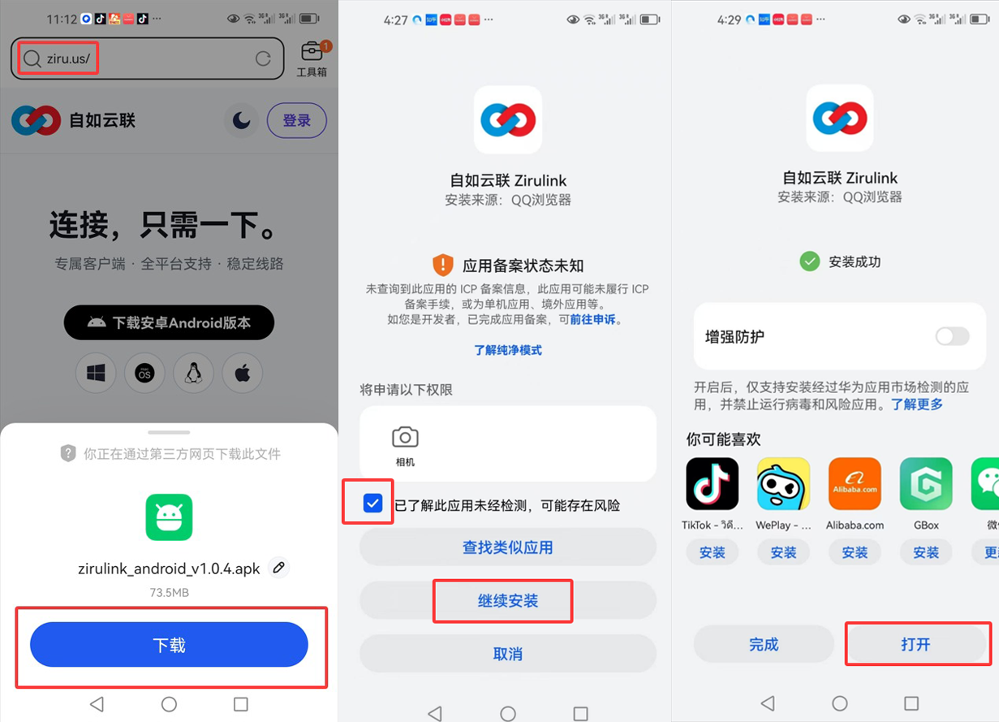
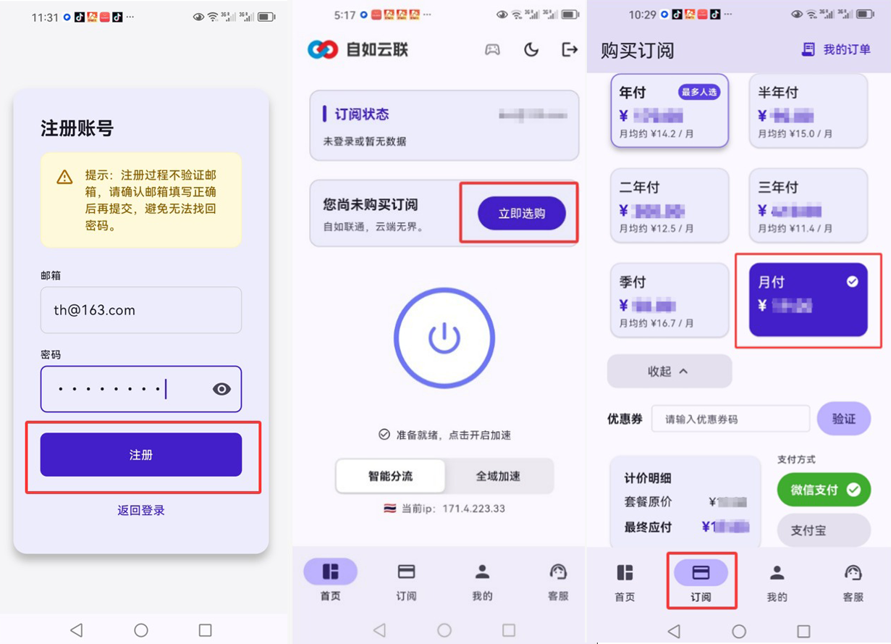
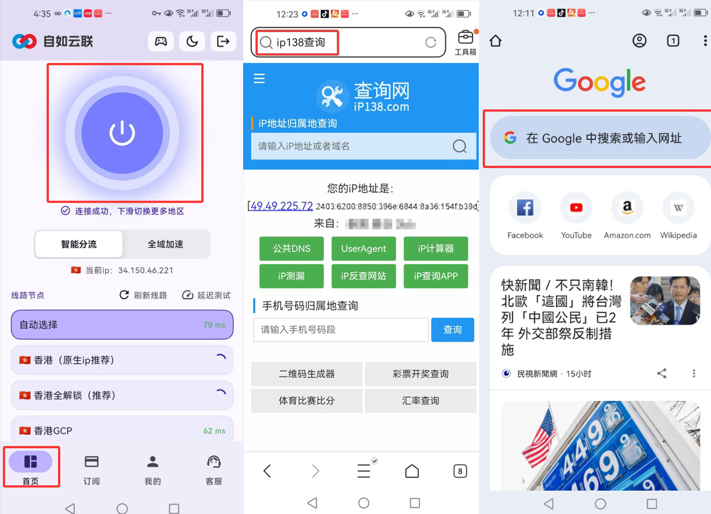

# ZiruLink-Android-Setup-Guide
自如加速器 (ZiruLink) 安卓手机客户端全流程图文使用指南，助力一键极速连接全球。
# 📱 自如加速器 (ZiruLink) 安卓端全流程使用指南

> **自如加速器** 致力于为您提供稳定、极速的海外网络连接体验。本教程将带您完成从官网下载到 Google 搜索测试的全过程。

---

## 📸 图文教程步骤

### 1. 下载与安装
* **访问官网**：在手机浏览器输入 **ziru.us**。
* **获取应用**：点击首页的“下载安卓Android版本”按钮。
* **安全授权**：如遇系统拦截，请勾选“已了解此应用未经检测...”并选择“继续安装”安装完成后打开APP。

---

### 2. 账号注册与套餐购买
* **快速注册**：使用邮箱注册账号。 **提示**：注册过程不验证邮箱，请务必确认填写正确。
* **选购订阅**：在 App 内点击底部的“立即选购”页。
* **完成支付**：选择适合您的套餐（月付/年付等）并完成支付。

---

### 3. 一键启动与连通性测试
* **开启连接**：回到首页点击中间的“启动”大按钮。
* **显示成功**：当显示“连接成功”及当前 IP 地址时，加速服务已开启。
* **流畅度验证**：检测真实IP地址，并访问 Google 进行搜索测试，感受秒开网页的快感。

---

## 🔗 相关资源
* **官方网站**: [ziru.us](https://ziru.us)
* **性能监测白皮书**: [巴巴豆安全页面](https://www.babeedu.net/?p=760)
* **GitHub 技术主页**: [janhaas1980-south](https://github.com/janhaas1980-south/janhaas1980-south)

---
© 2026 自如加速器. 保留所有权利。
